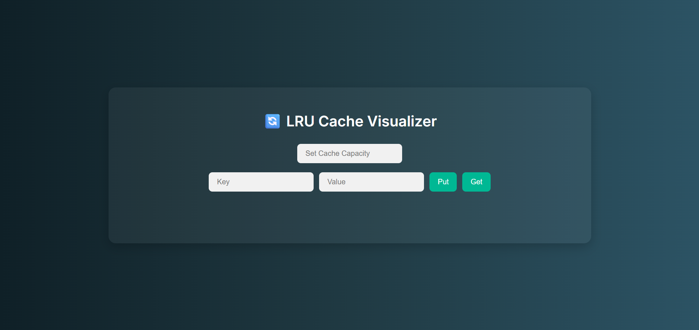

# 🔄 LRU Cache Visualizer

A web-based tool to visualize how a **Least Recently Used (LRU) Cache** works. This project helps users understand the logic behind LRU cache replacement by simulating `put` and `get` operations with a dynamic, linked list-style interface.

## 🚀 Live Demo

🔗 [View the live project here](https://SAMATHAMARRI.github.io/LRU-Cache-Visualizer)

---

## 🛠️ Features

-  Set a custom cache **capacity**.
-  Add and access **key-value pairs** with real-time feedback.
-  Visualizes the cache as a **doubly linked list**.
-  Highlights:
- **Yellow** – Updated or recently accessed nodes.
- **Red** – Evicted nodes when capacity is full.
- Fully **responsive UI** for all screen sizes.

---

## 🧑‍💻 Tech Stack

- **HTML** – Structure
- **CSS** – Styling and responsive layout
- **JavaScript** – Cache logic and DOM manipulation

---

## 📸 Screenshots

---

## 📂 How to Run Locally

   git clone https://github.com/SAMATHAMARRI/LRU-Cache-Visualizer.git
